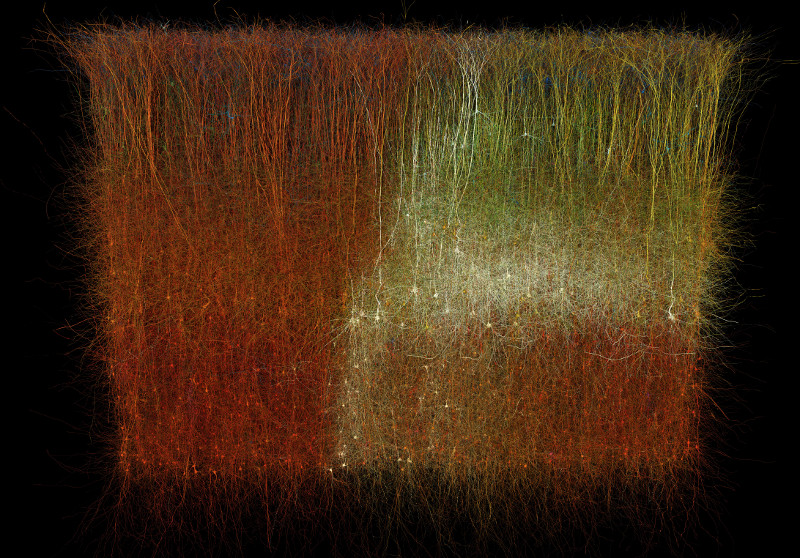

# Circuit explorer plug-in for Brayns

## Description
This module implements the visualization of BBP circuits

## Usage
- Point LD_LIBRARY_PATH to the folder which contains
  'libCircuitExplorer.so'
- Run Brayns application either with command line '--plugin CircuitExplorer'

## Screenshots

